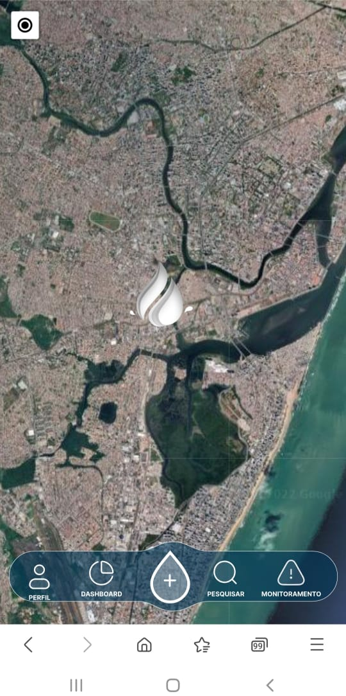

# AquaAnalytic

> Aplicativo criado para a facilitação no monitoramento da qualidade da água em rios e reservatórios.

## 💻 Pré-requisitos

Antes de começar, verifique se você atendeu aos seguintes requisitos:

* Você tem uma máquina `<Windows / Linux / Mac>`.
* Você precisa ter instalado em sua máquina: `<node.js, npm e ionic>`.

## ☕ Como rodar o projeto

Para usar <nome_do_projeto>, siga estas etapas:

* Instalando o ionic: `<npm install -g @ionic/cli>`
* Rodando o app: `<ionic serve>`

## 🚀 Instalando o **Aqua Analytic**

Acesse a pasta no Drive e faça o download do apk:

* [APK]()

## 📚 Documentação

Pasta no Drive com todas as documentações
* [Pasta de documentações](https://drive.google.com/drive/folders/1KcZMAwcVrLAjT_p5U8wHwvKLyodJMZjV)

## 🤝 Colaboradores

Todas as pessoas que contribuíram para este projeto:

<table>
  <tr>
    <td align="center">
      <a href="https://github.com/KDU15">
         
        
          <b>Carlos Eduardo</b>
        
      </a>
    </td>
    <td align="center">
      <a href="https://github.com/IanTth">
         
        
          <b>Ian Rendrick</b>
        
      </a>
    </td>
    <td align="center">
      <a href="https://github.com/isabellemaria">
         
        
          <b>Isabelle Maria</b>
        
      </a>
    </td>
    <td align="center">
      <a href="https://github.com/LucasTMB">
         
        
          <b>Lucas Teixeira</b>
        
      </a>
    </td>
    <td align="center">
      <a href="https://github.com/renatofariass">
         
        
          <b>Renato Alberto</b>
        
      </a>
    </td>
  </tr>
</table>